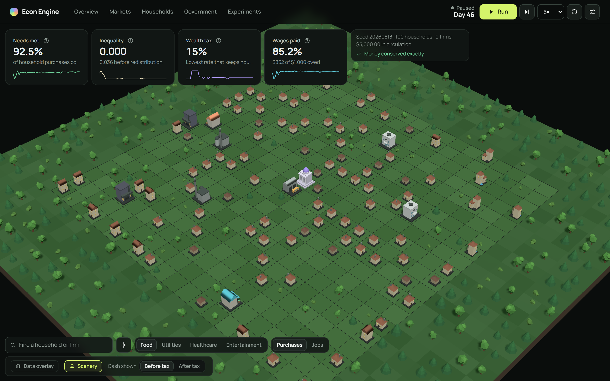
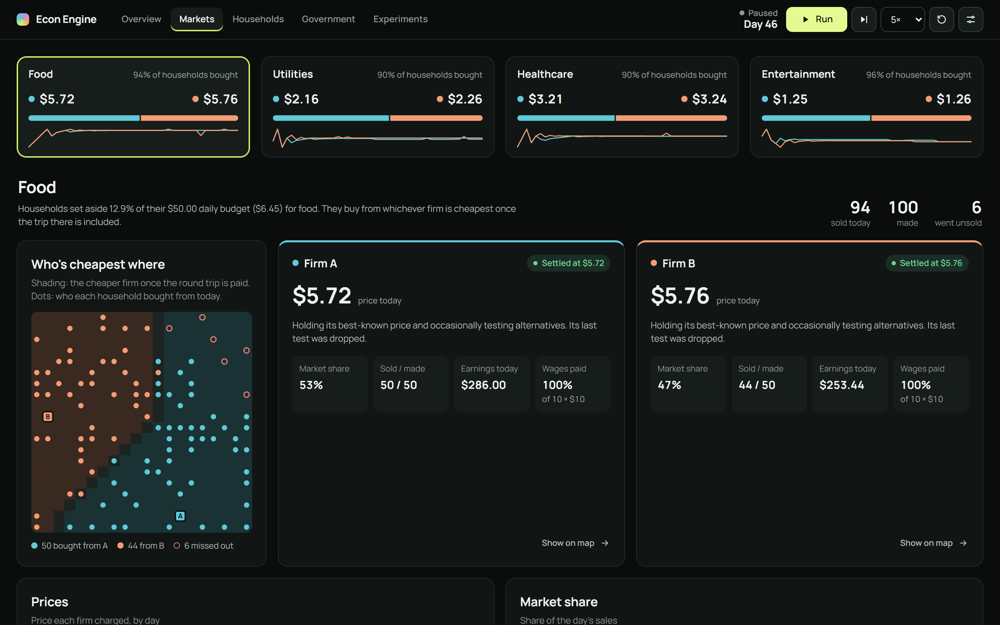
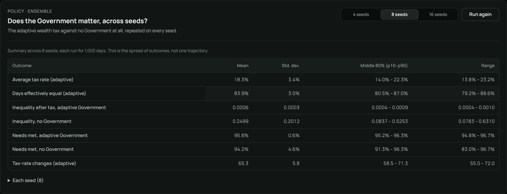

# Econ-Engine

A deterministic agent-based economy you can watch and inspect in the browser: 100 households, nine firms and a Government, with every cent accounted for. Every run is reproducible from its seed.

**[▶ Open the live simulator](https://neolorenzo.github.io/Econ-Engine/)**. It runs entirely in your browser; there is nothing to install.

Current model: MVP8, population scaling. The [changelog](CHANGELOG.md) records every update.



## What you can explore

The simulator opens on a 3D town. Each house is a household, from a shack to a villa as its cash grows. Each firm's building shows its industry (a market hall for Food, a plant for Utilities, a clinic for Healthcare, a cinema for Entertainment) and its roof shows which firm it is. The Transport depot and the Government hall stand near the centre for reference. Grass, trees and a ring of forest surround the town; the Scenery switch hides them. The Data overlay switch adds a translucent cash pillar around every house and colours the floor by which firm is cheapest where. Headline numbers float above it. Click anything to inspect it. Each section opens as a panel over the world, which stays live beside it, and "Locate" in a panel flies the camera to that household or firm.

| Section | What it shows |
| --- | --- |
| **Overview** | The day's money circuit between households, firms and Government, a plain-language feed of notable changes, and every market at a glance. |
| **Markets** | The four consumer markets (Food, Utilities, Healthcare, Entertainment): each firm's price, share, sales and wages, a top-down map of who bought where, and price, share and earnings over time. |
| **Households** | Every household's cash before and after redistribution, wages, purchases and employer, searchable and sortable. |
| **Government** | The current wealth-tax rate and how the Government's trials moved it, what it collected and paid back, and inequality before and after. |
| **Experiments** | Longer-run research questions, replayed from day 0 in a background worker without touching the live run. |



### Research questions

The Experiments section answers each question for the current seed:

- **Does the Government matter?** The adaptive wealth tax against no Government, over 1,000 days.
- **Who wins each market?** How often market leadership changes hands, and each firm's share, price and revenue over 1,000 days.
- **Jobs and wealth over time.** Every household's and employer's 1,000-day trajectory: who stays poor, who gets ahead, and why purchases fail.
- **Small vs large economy.** The same seed at 10 and 100 households, compared per household.

**Across many seeds.** One seed is one random path. The ensembles rerun the scale, Government and competition questions on 4, 8 or 16 seeds in parallel. They report the mean, standard deviation, middle 80% and range of each outcome, with every seed's value one click away.



How each mechanism works and how it was validated is in the [MVP 8 specification](docs/MVP8_SPEC.md), the [architecture notes](docs/ARCHITECTURE.md) and the [validation guide](docs/VALIDATION.md).

## Run locally

```bash
npm install
npm run dev
npm run lint      # oxlint and the Prettier check
npm run format    # apply Prettier
npm run test:run
npm run typecheck
npm run build
npm run check     # lint, typecheck, tests, and build
```

## Model at a glance

- One hundred households have fixed seeded employment and persistent cash.
- Eight competitive consumer firms each employ ten workers and produce 50 units per day; monopoly Transport employs 20 workers.
- Households choose by delivered cost within percentage expenditure budgets. Purchases pay firms; contractual payroll is capped by cash and residual profit is taxed explicitly.
- Government acts only after payroll, starts at 0%, and tests seeded 0–100% wealth-tax alternatives.
- Tax rates use integer basis points; liabilities use floor-to-cent rounding.
- Every receipt returns explicitly through deterministic means-tested water filling. Government cannot borrow or create money.
- Money uses integer cents and remains exactly household count × $50 ($5,000 canonically). Live histories remain bounded; finite research harnesses retain full trajectory observations separately.

## Architecture

The pure TypeScript core in `src/sim` owns markets, employment/payroll, Government policy and fiscal transfers, events, metrics, experiments, ensembles, and invariants. React owns controls and presentation only, so the UI never changes economic behavior.

Read the current [MVP 8 specification](docs/MVP8_SPEC.md), [architecture notes](docs/ARCHITECTURE.md), [validation guide](docs/VALIDATION.md), and authoritative [simulation design rules](SIMULATION_DESIGN_RULES.md). Project evolution is recorded in the [changelog](CHANGELOG.md) and [lab notes](LAB_NOTES.md).

## Deployment

Pushes to `main` validate and deploy the static Vite bundle to [GitHub Pages](https://neolorenzo.github.io/Econ-Engine/).

## Current limits

Government is deliberately narrow and stylized: one flat cash-wealth tax, one Gini objective, no forecasting, and one equalizing transfer rule. There are no other taxes, benefits, public purchases, borrowing, money creation, monetary policy, or welfare/consumption objectives.

## Direction

The long-term aim is an institution-agnostic engine: markets, taxes, governments and other institutions should emerge from agents' decisions instead of being built in. The [vision document](docs/VISION.md) describes that direction and an incremental path towards it. It is not a description of the current model.
